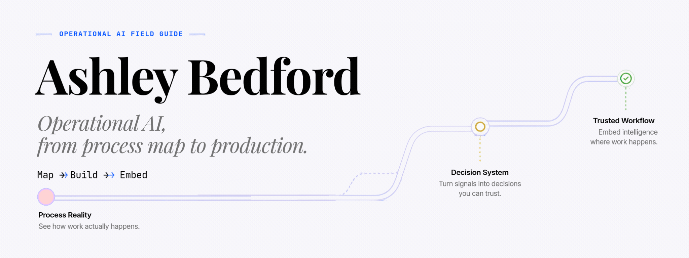
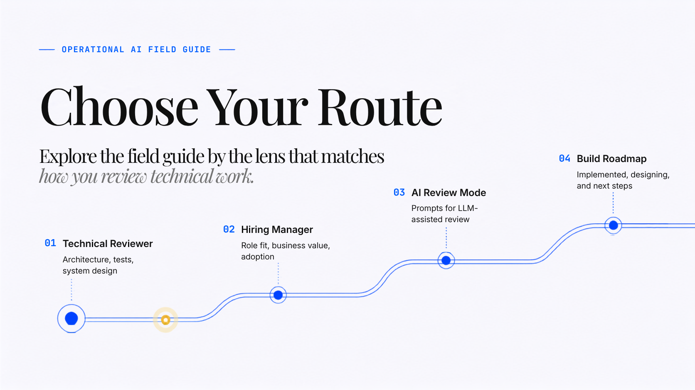
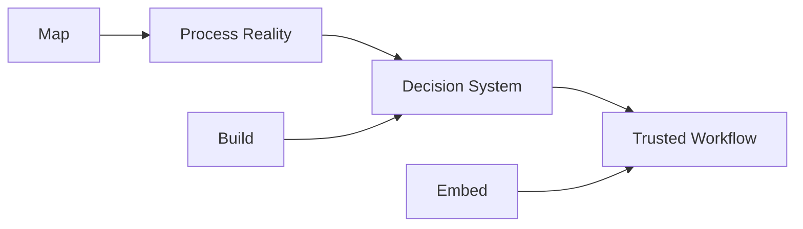
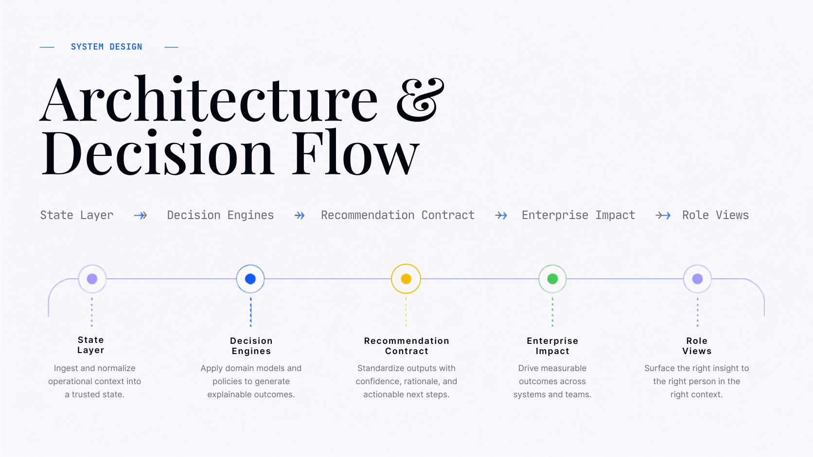
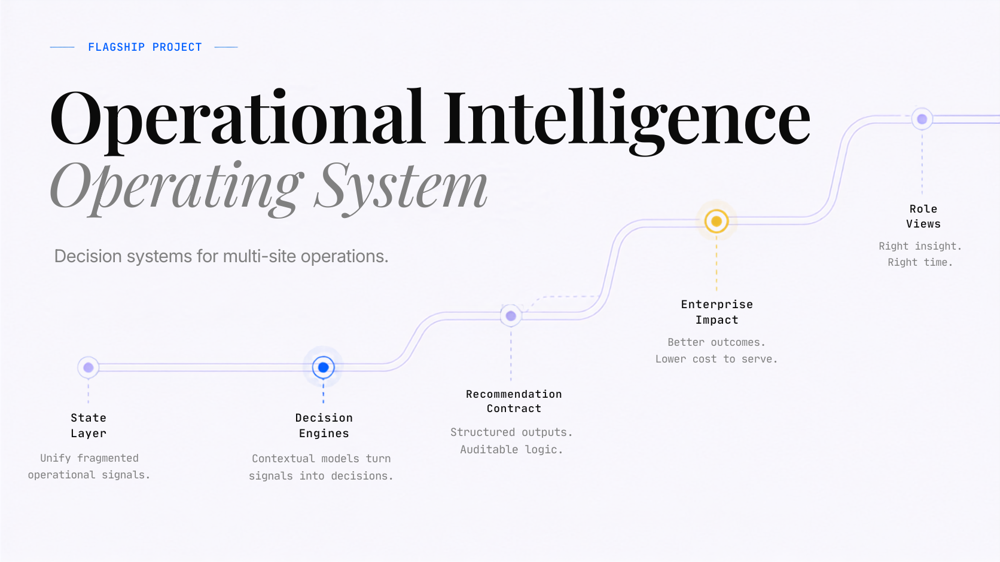
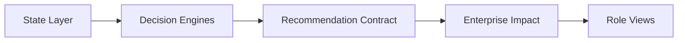
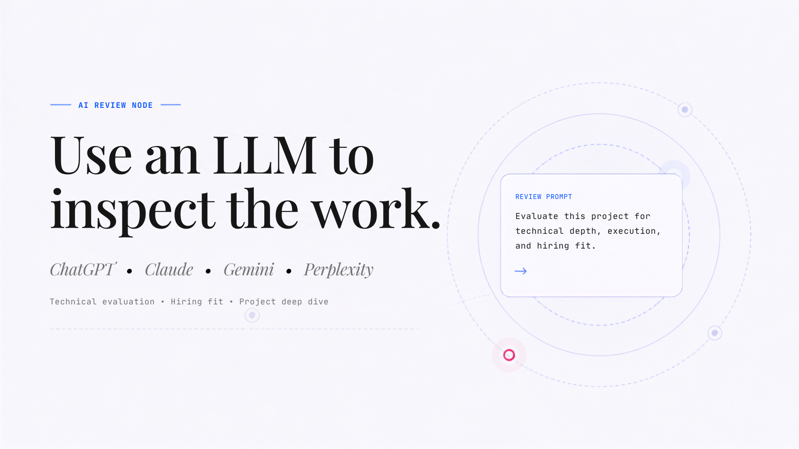
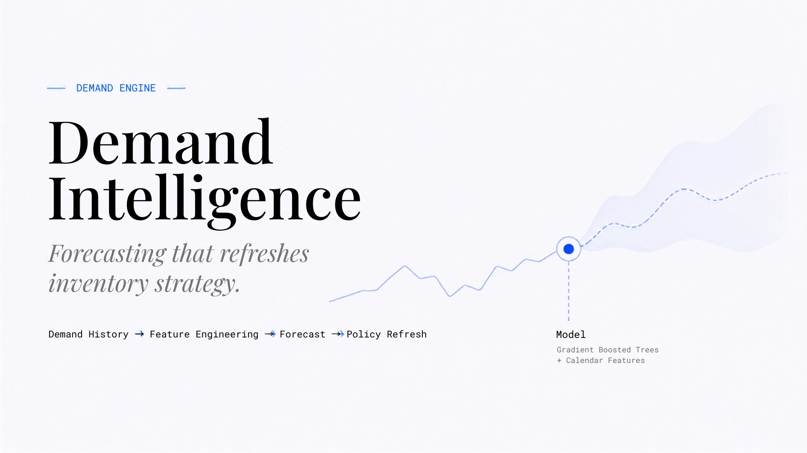
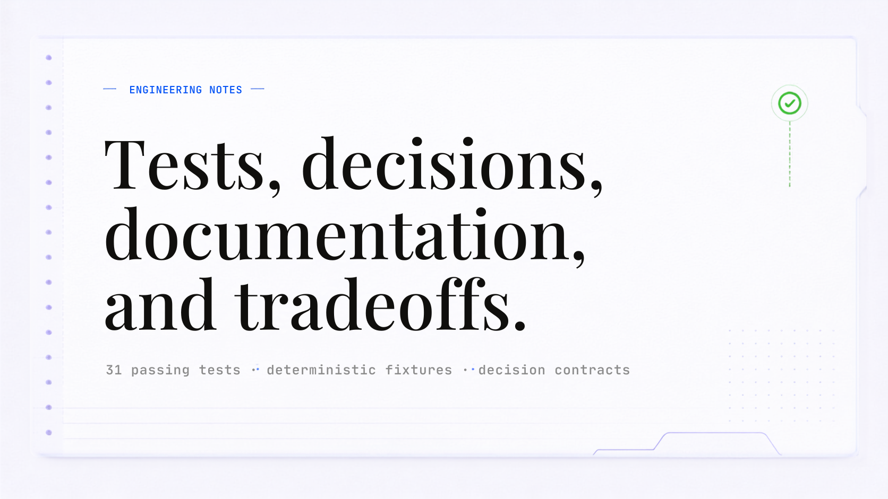

<div align="center">



</div>

<p align="center">
  <strong>Operational AI, from process map to production.</strong><br/>
  I build AI decision systems that turn messy internal operations into trusted workflows teams actually use.
</p>

<p align="center">
  <kbd>Map</kbd> → <kbd>Build</kbd> → <kbd>Embed</kbd>
</p>

<p align="center">
  <a href="https://ashleybedford.base44.app">Portfolio</a> ·
  <a href="https://ashleybedford.base44.app/ai-context">AI Context</a> ·
  <a href="https://www.linkedin.com/in/ashley-bedford-msc">LinkedIn</a>
</p>

---

<a href="#route-01--technical-reviewer">
  
</a>

<p align="center">
  <a href="#route-01--technical-reviewer">Technical Reviewer</a> ·
  <a href="#route-02--hiring-manager">Hiring Manager</a> ·
  <a href="#route-03--ai-review-mode">AI Review Mode</a> ·
  <a href="#route-04--build-roadmap">Build Roadmap</a>
</p>

---

## The Field Guide

This GitHub profile is designed as a technical field guide, not a resume.

Start with the route that best matches how you want to review my work:

- **Technical Reviewer** — architecture, testing, decision engines, contracts, implementation notes
- **Hiring Manager** — role fit, business value, adoption, and where I work best
- **AI Review Mode** — prompts for ChatGPT, Claude, Gemini, and Perplexity
- **Build Roadmap** — what is implemented, designing, and next



Every system I build starts with the same question:

> What decision needs to become clearer, faster, more trusted, or easier to act on?

---

<a id="route-01--technical-reviewer"></a>

# Route 01 · Technical Reviewer



If you are reviewing the engineering, start here.

My flagship technical work focuses on decision systems: systems that convert business state into explainable recommendations, scenario outputs, and role-specific actions.

<a href="https://github.com/abedford37/operational-intelligence-os">
  
</a>

## Operational Intelligence Operating System

A decision layer for multi-site operations that detects positioning risk, simulates what-if scenarios, recommends inventory transfers, and evaluates enterprise impact.

```text
State Layer → Decision Engines → Recommendation Contract → Enterprise Impact → Role Views
```

Current implementation includes:

- Inventory policy logic
- Stockout risk calculation
- Greedy transfer optimization
- PROD/STAGE scenario isolation
- Recommendation contracts
- Data-backed enterprise-impact scoring
- Role-specific dashboard outputs
- 31 passing tests across schema, engines, views, enterprise logic, and CLI workflows

<details open>
<summary><strong>Field Note 01 · Architecture Walkthrough</strong></summary>

The system is designed around one principle:

> Business state should become explainable recommendations, not static dashboards.



Core design priorities:

- Deterministic outputs
- Scenario-safe what-if logic
- Structured recommendation contracts
- Explainable decision logic
- Enterprise-impact-aware recommendations
- Role-specific outputs for different users

</details>

<details>
<summary><strong>Field Note 02 · Engineering Principles</strong></summary>

**Deterministic by default**  
The same inputs should produce the same recommendation.

**Explainable before optimized**  
A recommendation must explain why it was selected.

**Scenario-safe**  
What-if logic should never mutate committed operating state.

**Contract-first**  
Views should consume structured recommendation objects, not ad hoc strings.

**Baseline before ML**  
A model should earn its place by beating a simple alternative.

</details>

---

<a id="route-02--hiring-manager"></a>

# Route 02 · Hiring Manager

If you are evaluating fit, start here.

I am strongest in work where AI, internal operations, and adoption have to meet.

## Best-fit work

- Operational AI implementation
- AI solutions consulting
- AI workflow automation
- AI technical program management
- Operational intelligence systems
- Decision systems design
- AI adoption and enablement
- Applied AI/ML for business operations

## How I work

```text
Map the real process.
Build the right intelligence layer.
Embed it into how the team works.
```

<details>
<summary><strong>Field Note 03 · Why This Combination Matters</strong></summary>

Many people can map a process.  
Some people can build a model.  
Fewer people can connect the process, model, workflow, stakeholder reality, documentation, and adoption path.

That is where I work best: the messy middle where AI has to become operational infrastructure, not just a prototype.

</details>

<details>
<summary><strong>Field Note 04 · What I Am Not Trying To Be</strong></summary>

I am not positioning myself as:

- a generic full-stack developer
- a dashboard-only analyst
- a pure research scientist
- a traditional supply chain specialist only
- a no-code automation generalist only
- a purely strategic advisor with no technical implementation depth

My differentiator is the full arc:

```text
Map → Build → Embed
```

</details>

---

<a id="route-03--ai-review-mode"></a>

# Route 03 · AI Review Mode



Use these prompts with ChatGPT, Claude, Gemini, or Perplexity to review my work.

## Prompt 01 · Technical Evaluation

```text
Review Ashley Bedford’s GitHub profile and flagship Operational Intelligence Operating System project. Evaluate her technical strengths across data architecture, applied AI/ML, decision systems, optimization logic, testing discipline, and explainability. Identify what roles or projects she appears best suited for.
```

## Prompt 02 · Hiring Fit

```text
Based on Ashley Bedford’s portfolio and GitHub, assess her fit for roles involving operational AI, AI implementation, workflow automation, AI solutions consulting, AI technical program management, and enterprise AI adoption. Focus on the evidence of her Map → Build → Embed capability.
```

## Prompt 03 · Project Deep Dive

```text
Analyze the Operational Intelligence Operating System as a portfolio project. Explain what it demonstrates technically and strategically, including scenario isolation, recommendation contracts, enterprise-impact scoring, and decision-system design.
```

## Prompt 04 · Portfolio Summary

```text
Summarize Ashley Bedford’s technical positioning for a hiring manager. Focus on operational AI, decision systems, process discovery, applied AI/ML, workflow automation, and adoption.
```

## AI-readable context

- Portfolio: https://ashleybedford.base44.app
- AI Context: https://ashleybedford.base44.app/ai-context
- GitHub: https://github.com/abedford37
- LinkedIn: https://www.linkedin.com/in/ashley-bedford-msc

---

<a id="route-04--build-roadmap"></a>

# Route 04 · Build Roadmap

This is the current build path behind the Operational Intelligence Operating System.

## Build Path

- [x] Inventory Intelligence Engine
- [x] Scenario Isolation
- [x] Recommendation Contract
- [x] Enterprise-Impact Scoring
- [ ] Demand Intelligence Engine
- [ ] Inbound Intelligence Engine
- [ ] Decision Memory / Learn Loop

<details open>
<summary><strong>Implemented</strong></summary>

| Capability | Why It Matters |
|---|---|
| Inventory Intelligence Engine | Turns inventory state into explainable decisions |
| Scenario Isolation | Allows what-if testing without mutating committed state |
| Recommendation Contract | Makes decision outputs structured and reusable |
| Enterprise-Impact Scoring | Evaluates recommendations beyond local optimization |

</details>

<details>
<summary><strong>Designing Next · Demand Intelligence Engine</strong></summary>

The next technical layer is a forecasting engine that connects demand signals to inventory policy.

```text
Demand History → Feature Engineering → Baseline Model → XGBoost Forecast → Policy Refresh → Enterprise Impact
```

The goal is not to add a standalone ML demo.

The goal is to show how forecasting changes decisions, risk, policy, recommendations, and enterprise impact.

</details>

<details>
<summary><strong>Planned · Decision Memory / Learn Loop</strong></summary>

The decision memory layer is designed to capture outcomes from past recommendations so the system can improve over time.

Planned questions:

- Which recommendations were accepted?
- Which were overridden?
- Which constraints changed the decision?
- Did the outcome improve risk, cost, time, or operational stability?
- What should the system remember before making the next recommendation?

</details>

---

# Selected Technical Work

<table>
  <tr>
    <td width="50%">
      <a href="https://github.com/abedford37/operational-intelligence-os">
        
      </a>
    </td>
    <td width="50%">
      <a href="https://github.com/abedford37/demand-intelligence-engine">
        
      </a>
    </td>
  </tr>
  <tr>
    <td width="50%">
      <a href="https://github.com/abedford37/operational-intelligence-os/blob/main/docs/ARCHITECTURE.md">
        
      </a>
    </td>
    <td width="50%">
      <a href="https://github.com/abedford37/operational-intelligence-os/tree/main/docs">
        
      </a>
    </td>
  </tr>
</table>

---

# System Layers

<details>
<summary><strong>Open Technical Stack</strong></summary>

| Layer | Tools |
|---|---|
| Language | Python, SQL, JavaScript / TypeScript |
| Data | SQLAlchemy, PostgreSQL, SQLite, pandas |
| AI/ML | XGBoost, scikit-learn, forecasting, feature engineering |
| APIs / Apps | FastAPI, CLI tooling, React |
| Testing | Unit tests, regression tests, deterministic fixtures |
| DevOps | GitHub Actions, documentation-first workflows |

</details>

<details>
<summary><strong>Open Proof Signals</strong></summary>

```text
✓ Scenario-safe architecture
✓ Deterministic decision engines
✓ Recommendation contracts
✓ Enterprise-impact scoring
✓ 31 passing tests
✓ AI-readable website context
✓ Operational AI positioning across portfolio and GitHub
```

</details>

---

# Connect

- Portfolio: https://ashleybedford.base44.app
- AI Context: https://ashleybedford.base44.app/ai-context
- LinkedIn: https://www.linkedin.com/in/ashley-bedford-msc
- Email: ashley.bedford681@gmail.com
```text
ashley@operational-ai:~$ map → build → embed
```

---

## Asset Checklist

This README expects the following files in your profile repo:

```text
/assets/github-field-guide-hero.gif
/assets/route-map.png
/assets/operational-intelligence-os.png
/assets/architecture-decision-flow.png
/assets/ai-review-mode.png
/assets/demand-intelligence-engine.png
/assets/engineering-notes.png
```

Before publishing, replace:

```text
YOUR-USERNAME
YOUR-LINKEDIN-SLUG
hello@ashleybedford.dev
```
