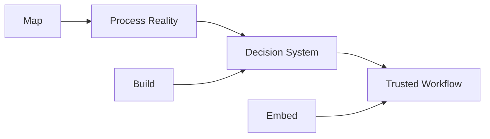
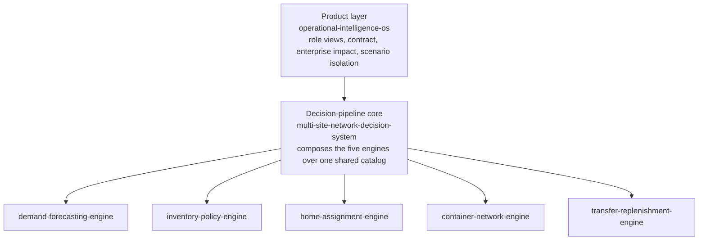
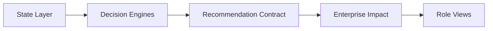

<div align="center">


</div>

<p align="center">
  <strong>Operational AI, from process map to production.</strong><br/>
  I build AI decision systems that turn messy internal operations into trusted workflows teams actually use.
</p>

<p align="center">
  <kbd>Map</kbd> to <kbd>Build</kbd> to <kbd>Embed</kbd>
</p>

<p align="center">
  <a href="https://ashleybedford.base44.app">Portfolio</a> ·
  <a href="https://ashleybedford.base44.app/ai-context">AI Context</a> ·
  <a href="https://www.linkedin.com/in/ashley-bedford-msc">LinkedIn</a>
</p>

---

<a href="#route-01--technical-reviewer">
  
</a>

<p align="center">
  <a href="#route-01--technical-reviewer">Technical Reviewer</a> ·
  <a href="#route-02--hiring-manager">Hiring Manager</a> ·
  <a href="#route-03--ai-review-mode">AI Review Mode</a> ·
  <a href="#route-04--build-roadmap">Build Roadmap</a>
</p>

---

## The Field Guide

This GitHub profile is designed as a technical field guide, not a resume.

Start with the route that best matches how you want to review my work:

- **Technical Reviewer**, architecture, testing, decision engines, contracts, and the three-layer system
- **Hiring Manager**, role fit, business value, adoption, and where I work best
- **AI Review Mode**, prompts for ChatGPT, Claude, Gemini, and Perplexity
- **Build Roadmap**, what is implemented, and what is next



Every system I build starts with the same question:

> What decision needs to become clearer, faster, more trusted, or easier to act on?

---

<a id="route-01--technical-reviewer"></a>

# Route 01 · Technical Reviewer


If you are reviewing the engineering, start here.

My flagship work is one system built in three layers: a product that turns network state
into explainable recommendations and role views, a decision pipeline that feeds it, and
five standalone engines beneath that. Each layer stands on its own, with its own tests.

<a href="https://github.com/abedford37/operational-intelligence-os">
  
</a>

## Operational Intelligence Operating System

The product layer, and the flagship. A decision layer for multi-site operations that
detects positioning risk, simulates what-if scenarios, recommends explainable inventory
transfers, and evaluates enterprise impact, then puts each recommendation in front of the
right role. It proves the full arc, from state to a decision a team can act on, on one
decision family.

```text
State Layer -> Decision Engines -> Recommendation Contract -> Enterprise Impact -> Role Views
```

It now consumes the decision pipeline below as its decision core: policy, forecast, and
home come from the specialized engines, and the product layer does what it is for on top.

- Positioning risk and stockout calculation
- Explainable greedy transfer optimization with binding constraints and alternatives
- PROD/STAGE scenario isolation, enforced structurally
- Recommendation contract as the source of truth for every view
- Data-backed enterprise-impact scoring, local versus global
- Capability model: propose, approve, and commit are separate
- Consumes the pipeline's decision record and runs its engines on the derived network
- 36 tests across schema, engines, views, enterprise logic, CLI, and the integration seam

## The system, three layers

The flagship is the top of a three-layer system. The links below are the whole thing.



- Product: [operational-intelligence-os](https://github.com/abedford37/operational-intelligence-os)
- Decision-pipeline core: [multi-site-network-decision-system](https://github.com/abedford37/multi-site-network-decision-system)
- Components: [demand-forecasting-engine](https://github.com/abedford37/demand-forecasting-engine), [inventory-policy-engine](https://github.com/abedford37/inventory-policy-engine), [home-assignment-engine](https://github.com/abedford37/home-assignment-engine), [container-network-engine](https://github.com/abedford37/container-network-engine), [transfer-replenishment-engine](https://github.com/abedford37/transfer-replenishment-engine)

<details open>
<summary><strong>Field Note 01 · Architecture Walkthrough</strong></summary>

The system is designed around one principle:

> Business state should become explainable recommendations, not static dashboards.

Inside the product layer, the flow is one directional and trivially testable: state in,
pure engines compute a plan, the report layer reshapes it into role views, renderers emit
HTML. Nothing downstream writes back upstream.



The [system map](https://github.com/abedford37/operational-intelligence-os/blob/main/docs/SYSTEM_MAP.md)
shows how the product layer, the pipeline, and the engines connect, and where the
integration seam lives.

</details>

<details>
<summary><strong>Field Note 02 · Engineering Principles</strong></summary>

**Deterministic by default**  
The same inputs should produce the same recommendation.

**Explainable before optimized**  
A recommendation must explain why it was selected.

**Scenario-safe**  
What-if logic should never mutate committed operating state.

**Contract-first**  
Views should consume structured recommendation objects, not ad hoc strings.

**Baseline before ML**  
A model should earn its place by beating a simple alternative.

**Compose, do not duplicate**  
Each decision is one engine with one job; the pipeline composes them; the product
consumes the result.

</details>

---

<a id="route-02--hiring-manager"></a>

# Route 02 · Hiring Manager

If you are evaluating fit, start here.

I am strongest in work where AI, internal operations, and adoption have to meet.

## Best-fit work

- Operational AI implementation
- AI solutions consulting
- AI workflow automation
- AI technical program management
- Operational intelligence systems
- Decision systems design
- AI adoption and enablement
- Applied AI/ML for business operations

## How I work

```text
Map the real process.
Build the right intelligence layer.
Embed it into how the team works.
```

<details>
<summary><strong>Field Note 03 · Why This Combination Matters</strong></summary>

Many people can map a process.  
Some people can build a model.  
Fewer people can connect the process, model, workflow, stakeholder reality, documentation, and adoption path.

That is where I work best: the messy middle where AI has to become operational infrastructure, not just a prototype.

</details>

<details>
<summary><strong>Field Note 04 · What I Am Not Trying To Be</strong></summary>

I am not positioning myself as:

- a generic full-stack developer
- a dashboard-only analyst
- a pure research scientist
- a traditional supply chain specialist only
- a no-code automation generalist only
- a purely strategic advisor with no technical implementation depth

My differentiator is the full arc:

```text
Map -> Build -> Embed
```

</details>

---

<a id="route-03--ai-review-mode"></a>

# Route 03 · AI Review Mode


Use these prompts with ChatGPT, Claude, Gemini, or Perplexity to review my work.

## Prompt 01 · Technical Evaluation

```text
Review Ashley Bedford's GitHub (github.com/abedford37) and her flagship Operational Intelligence Operating System, which sits on top of a five-engine decision pipeline (multi-site-network-decision-system). Evaluate her strengths across data architecture, applied AI/ML, decision systems, optimization logic, testing discipline, explainability, and systems integration. Identify the roles she appears best suited for.
```

## Prompt 02 · Hiring Fit

```text
Based on Ashley Bedford's portfolio and GitHub, assess her fit for roles in operational AI, AI implementation, workflow automation, AI solutions consulting, AI technical program management, and enterprise AI adoption. Focus on evidence of her Map, Build, Embed capability across the three-layer system: product, pipeline, and engines.
```

## Prompt 03 · Project Deep Dive

```text
Analyze the three-layer system on github.com/abedford37: the Operational Intelligence OS as the product layer, the multi-site-network-decision-system as the decision-pipeline core, and the five standalone engines as components. Explain what it demonstrates technically and strategically, including scenario isolation, recommendation contracts, enterprise-impact scoring, and the integration seam where the product consumes the pipeline's decision record.
```

## Prompt 04 · Portfolio Summary

```text
Summarize Ashley Bedford's technical positioning for a hiring manager. Focus on operational AI, decision systems, process discovery, applied AI/ML, workflow automation, systems integration, and adoption.
```

## AI-readable context

- Portfolio: https://ashleybedford.base44.app
- AI Context: https://ashleybedford.base44.app/ai-context
- GitHub: https://github.com/abedford37
- LinkedIn: https://www.linkedin.com/in/ashley-bedford-msc

---

<a id="route-04--build-roadmap"></a>

# Route 04 · Build Roadmap

Status is tracked honestly. Implemented means it runs in a public repository.

## Build Path

- [x] Five standalone decision engines (demand, policy, home, container, transfer)
- [x] Decision pipeline composing the five engines over one shared catalog
- [x] Operational Intelligence OS product layer, one decision family end to end
- [x] Integration seam: the product consumes the pipeline's decision record
- [ ] Decision Memory / Learn Loop
- [ ] Cross-department coordination engines
- [ ] MILP transfer solver as a bounded challenger

<details open>
<summary><strong>Implemented</strong></summary>

| Capability | Why It Matters |
|---|---|
| Five standalone engines | Each decision solved once, tested, with cited methods |
| Decision pipeline (MSDN) | Composes the engines into one network decision per item |
| Operational Intelligence OS | Turns that decision into risk, transfers, impact, and role views |
| Integration seam | The product runs its engines on a pipeline-derived network, policy and forecast sourced upstream |
| Scenario isolation | What-if testing without mutating committed state |
| Enterprise-impact scoring | Evaluates recommendations beyond local optimization |

</details>

<details>
<summary><strong>Designing Next · Decision Memory / Learn Loop</strong></summary>

The decision memory layer is designed to capture outcomes from past recommendations so the system can improve over time.

Planned questions:

- Which recommendations were accepted?
- Which were overridden?
- Which constraints changed the decision?
- Did the outcome improve risk, cost, time, or operational stability?
- What should the system remember before making the next recommendation?

</details>

---

# Selected Technical Work

<table>
  <tr>
    <td width="33%">
      <a href="https://github.com/abedford37/operational-intelligence-os">
        
      </a>
    </td>
    <td width="33%">
      <a href="https://github.com/abedford37/operational-intelligence-os/blob/main/docs/SYSTEM_MAP.md">
        
      </a>
    </td>
    <td width="33%">
      <a href="https://github.com/abedford37/operational-intelligence-os/tree/main/docs">
        
      </a>
    </td>
  </tr>
</table>

The decision-pipeline core: [multi-site-network-decision-system](https://github.com/abedford37/multi-site-network-decision-system).

The five component engines: [demand-forecasting-engine](https://github.com/abedford37/demand-forecasting-engine),
[inventory-policy-engine](https://github.com/abedford37/inventory-policy-engine),
[home-assignment-engine](https://github.com/abedford37/home-assignment-engine),
[container-network-engine](https://github.com/abedford37/container-network-engine),
[transfer-replenishment-engine](https://github.com/abedford37/transfer-replenishment-engine).

---

# System Layers

<details>
<summary><strong>Open Technical Stack</strong></summary>

| Layer | Tools |
|---|---|
| Language | Python, SQL |
| Data | SQLAlchemy, SQLite, pandas, numpy |
| AI/ML | XGBoost, scikit-learn, forecasting, feature engineering, intermittent-demand classification |
| Optimization | assignment, coverage, and greedy transfer heuristics with binding-constraint reporting |
| Testing | unit and regression tests, deterministic fixtures, integration tests across the seam |

</details>

<details>
<summary><strong>Open Proof Signals</strong></summary>

```text
Scenario-safe, deterministic decision engines
Recommendation contract as source of truth
Enterprise-impact scoring, local versus global
Five standalone engines composed by one pipeline
Product layer consuming the pipeline's decision record
Tests across every layer, product, pipeline, and each engine
```

</details>

---

# Connect

- Portfolio: https://ashleybedford.base44.app
- AI Context: https://ashleybedford.base44.app/ai-context
- LinkedIn: https://www.linkedin.com/in/ashley-bedford-msc
- Email: ashley.bedford681@gmail.com

```text
ashley@operational-ai:~$ map -> build -> embed
```
