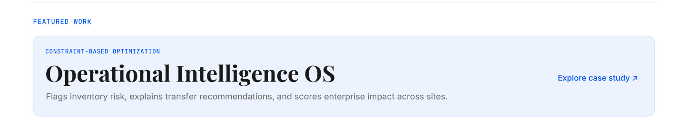
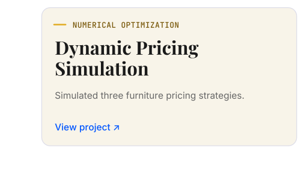
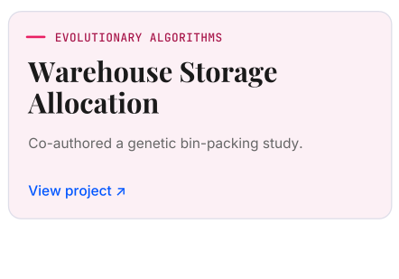
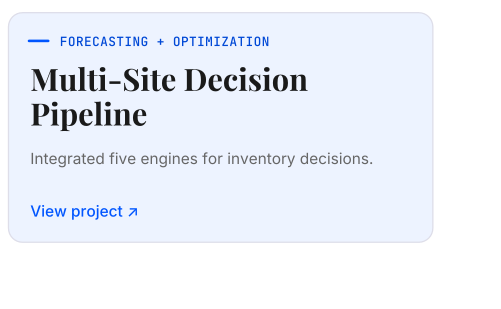

<a href="https://ashleybedford.base44.app/"><picture><source media="(prefers-color-scheme: dark)" srcset="./assets/ashley-profile-masthead-theme-dark.png"><source media="(prefers-color-scheme: light)" srcset="./assets/ashley-profile-masthead-theme-light.png"></picture></a>
<picture><source media="(prefers-reduced-motion: reduce)" srcset="./assets/ashley-profile-portrait-still-theme-neutral.png"></picture><picture><source media="(prefers-color-scheme: dark)" srcset="./assets/ashley-profile-hero-copy-theme-dark.png"><source media="(prefers-color-scheme: light)" srcset="./assets/ashley-profile-hero-copy-theme-light.png"></picture> <a href="https://www.linkedin.com/in/ashley-bedford-msc"><picture><source media="(prefers-color-scheme: dark)" srcset="./assets/ashley-profile-linkedin-theme-dark.png"><source media="(prefers-color-scheme: light)" srcset="./assets/ashley-profile-linkedin-theme-light.png"></picture></a><a href="https://theruntimediaries.com"><picture><source media="(prefers-color-scheme: dark)" srcset="./assets/ashley-profile-runtime-diaries-theme-dark.png"><source media="(prefers-color-scheme: light)" srcset="./assets/ashley-profile-runtime-diaries-theme-light.png"></picture></a>
<a href="https://ashleybedford.base44.app/operational-intelligence"><picture><source media="(prefers-color-scheme: dark)" srcset="./assets/ashley-profile-featured-theme-dark.png"><source media="(prefers-color-scheme: light)" srcset="./assets/ashley-profile-featured-theme-light.png"></picture></a>
<a href="https://github.com/abedford37/dynamic-pricing-simulation"><picture><source media="(prefers-color-scheme: dark)" srcset="./assets/ashley-profile-pricing-theme-dark.png"><source media="(prefers-color-scheme: light)" srcset="./assets/ashley-profile-pricing-theme-light.png"></picture></a><a href="https://github.com/abedford37/genetic-algorithm-storage-allocation"><picture><source media="(prefers-color-scheme: dark)" srcset="./assets/ashley-profile-storage-theme-dark.png"><source media="(prefers-color-scheme: light)" srcset="./assets/ashley-profile-storage-theme-light.png"></picture></a><a href="https://github.com/abedford37/multi-site-network-decision-system"><picture><source media="(prefers-color-scheme: dark)" srcset="./assets/ashley-profile-pipeline-theme-dark.png"><source media="(prefers-color-scheme: light)" srcset="./assets/ashley-profile-pipeline-theme-light.png"></picture></a>

